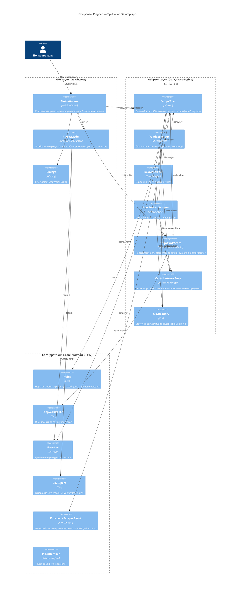

# Component Diagram — Spothound Desktop App

Внутреннее устройство единственного контейнера Spothound после рефакторинга на три слоя.

## Правила зависимостей

```
GUI → Adapters → Core
```

- **Core** не знает про Qt, браузер, файлы. Чистый C++17.
- **Adapters** реализуют контракты Core; могут зависеть от Qt/QtWebEngine/QFile.
- **GUI** знает про Adapters и Core; содержит только пользовательский интерфейс.

Нарушение направления (например, core ссылается на Qt) должно ломать сборку — `spothound-core` линкуется без Qt ([src/core/CMakeLists.txt](../../src/core/CMakeLists.txt)).

## Диаграмма



## Пояснение слоёв

### Core (`src/core/`)
Статическая библиотека без Qt. Если в любой файл core попадёт `#include <Qt*>` — сборка упадёт. Сюда переносится всё, что должно переиспользоваться на сервере.

- `Rules` ([src/core/rules.h](../../src/core/rules.h)) — нормализация ё→е, scoring по ключевым словам.
- `StopWordsFilter` ([src/core/stop_words_filter.h](../../src/core/stop_words_filter.h)) — чистая фильтрация.
- `PlaceRow` ([src/core/place_row.h](../../src/core/place_row.h)) — POD.
- `CsvExport` ([src/core/csv_export.h](../../src/core/csv_export.h)) — генерация CSV.
- `IScraper` + `ScraperEvent` ([src/core/i_scraper.h](../../src/core/i_scraper.h), [src/core/scraper_events.h](../../src/core/scraper_events.h)) — контракт скрапера и протокол событий.

### Adapter layer (`src/`)
Реализации, которые зависят от Qt или внешних библиотек.

- Скраперы (`YandexScraper`, `TwoGisScraper`, `GoogleMapsScraper`) наследуют `ScrapeTask`, который реализует `core::IScraper`.
- `StopWordsStore` — Qt-обёртка над `core::StopWordsFilter` с персистентностью через `QStandardPaths`.
- XLSX-экспорт (в `PlacesModel`) остаётся здесь — `QXlsx` тянет Qt.

### GUI layer (`src/`)
Окна, диалоги, модели для отображения. `MainWindow` не знает, какой именно скрапер создаётся — работает через фабрику по `sourceCombo`.

## Тестирование

Core покрыт unit-тестами на GoogleTest ([tests/core/](../../tests/core/)), запускаются без Qt и GUI. На момент написания: 24 теста.
