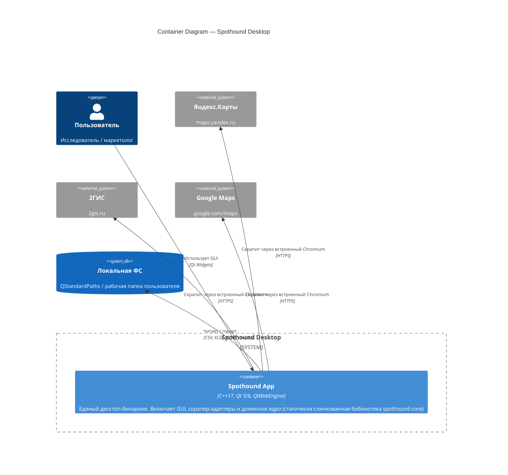

# Container Diagram — Spothound

Диаграмма контейнеров. Приложение — монолитный десктоп-бинарник, поэтому контейнеров мало; основная структура видна на уровне компонентов ([c4-components.md](c4-components.md)).

## Диаграмма

## Пояснение

На уровне контейнеров у Spothound один исполняемый артефакт — `spothound` (см. [CMakeLists.txt](../../CMakeLists.txt)). Внутри него:

- **GUI-слой** — Qt Widgets (MainWindow, диалоги, модели отображения).
- **Adapter-слой** — Qt-реализации скраперов (YandexScraper, TwoGisScraper, GoogleMapsScraper), персистентность (StopWordsStore), браузерный runtime (QtWebEngine).
- **Core** — `spothound-core`, статическая библиотека на чистом C++17 без зависимостей от Qt. Содержит доменную логику, контракты данных и событий.

Все три слоя компилируются в один бинарник. Разделение на контейнеры появится только при миграции на серверную архитектуру ([c4-future.md](c4-future.md)).

## Почему одна большая коробка, а не три

C4 определяет контейнер как **отдельно развёртываемую** единицу. `spothound-core` — статическая библиотека, линкуется внутрь `spothound.exe`, не развёртывается отдельно → это компонент, не контейнер. Аналогично для GUI и adapter-слоя: они выполняются в одном процессе.
