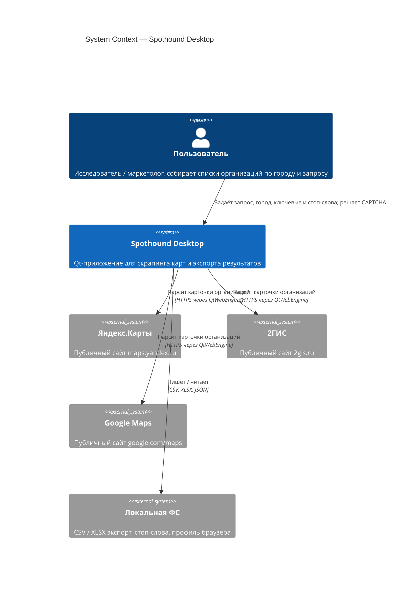

# System Context — Spothound

Диаграмма системного контекста для десктопного приложения Spothound.

## Диаграмма

## Пояснение

- **Пользователь** — один человек, запускает приложение локально.
- **Spothound Desktop** — единый Qt-бинарник с встроенным Chromium (QtWebEngine).
- **Внешние системы карт** — не имеют публичного API; доступ только через веб-страницы, отсюда браузерный скрапинг.
- **Локальная ФС** — вся персистентность (результаты, стоп-слова, cookies браузера). Нет серверной части, нет облака.

Контекст отражает текущее состояние: single-user desktop tool.
