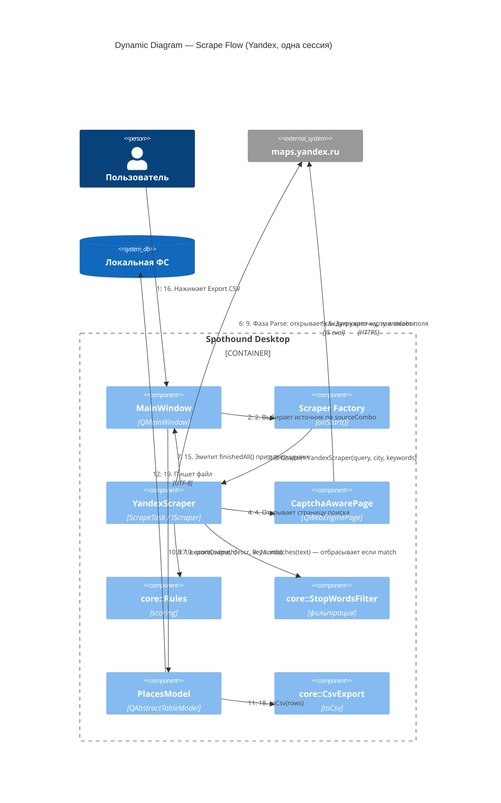

# Dynamic Diagram — Scraping Flow

Последовательность вызовов при запуске скрапинга пользователем (на примере YandexScraper).

## Диаграмма

## Комментарии к шагам

- **Шаги 6–8 (Grid-фаза)** специфичны для YandexScraper. TwoGisScraper и GoogleMapsScraper пропускают Grid-фазу: у них один sidebar, который прокручивается до конца. Переходят сразу к фазе Parse.
- **Шаг 11**: фильтрация стоп-слов применяется **перед** эмитом `result`. Отфильтрованные записи не попадают в модель и не видны пользователю.
- **CAPTCHA-branch (не показан)**: если `CaptchaAwarePage` детектирует капчу, скрапер эмитит `captchaRequested(page)`. MainWindow автоматически показывает браузерную панель с этой страницей, пользователь решает капчу руками, скрапинг продолжается.
- **Шаги 12–14**: `result` и `parseProgress` эмитятся на каждую успешно распарсенную карточку; модель обновляется инкрементально, пользователь видит результаты по мере появления.

## Что изменится на сервере

На серверной версии (см. [c4-future.md](c4-future.md)) шаги 6–14 выполняются в Playwright-воркере. Вместо Qt-сигналов скрапер вызывает `m_eventCallback(ScraperEvent)` из `core::IScraper`; API-gateway пересылает эти события клиенту через WebSocket. Протокол событий — тот же.
