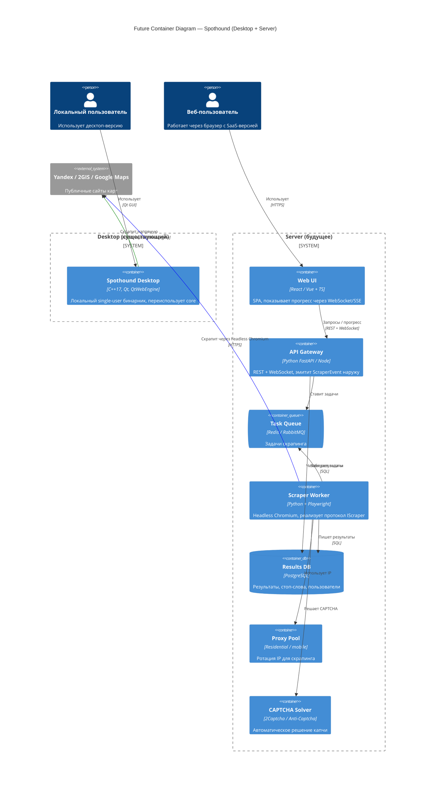

# Future State — Desktop + Server

Forward-looking диаграмма. Показывает, как архитектура эволюционирует, когда появится серверная версия и веб-UI. **Десктоп-приложение сохраняется** — сервер не заменяет его, а дополняет.

Документ описывает целевое состояние, а не план на ближайший квартал.

## Ключевая идея

`spothound-core` — общий доменный словарь между двумя мирами:

- **Desktop** продолжает жить на Qt + QtWebEngine. Локальный инструмент для одиночного пользователя, решает CAPTCHA руками.
- **Server** использует headless-браузер (Playwright) + прокси + CAPTCHA-солверы. Масштабируется горизонтально.

Общее между ними: формат `PlaceRow`, протокол событий `ScraperEvent`, алгоритмы scoring и фильтрации. Реализации скрапера — разные.

## Диаграмма контейнеров (будущее состояние)

## Что общее между Desktop и Server

Не показано на диаграмме отдельно, но по сути:

- **`PlaceRow` + JSON-схема** — общий формат результата. POD из core сериализуется в JSON одинаково в обеих реализациях.
- **`ScraperEvent` протокол** — enum событий `PhaseChanged / GridProgress / Result / CaptchaRequested / ...` одинаковый. В Desktop он эмитится как Qt-сигнал, на сервере — как WebSocket-сообщение.
- **`Rules` и `StopWordsFilter`** — одни и те же алгоритмы. На сервере — порт на Python/Node (алгоритм маленький, переписывается за день), либо переиспользование `spothound-core` через pybind11.

## Почему именно так

- **Desktop остаётся** потому что он решает задачу, которую сервер решает плохо и дорого: реальный пользовательский профиль с живыми cookies, ручное решение CAPTCHA, низкие объёмы без прокси. Для одного пользователя с небольшими запросами десктоп дешевле и надёжнее.
- **Сервер** нужен для масштабирования на многих пользователей, регулярных запусков, веб-интерфейса, API. QtWebEngine на сервере — дорого и плохо параллелится; Playwright решает эти задачи на порядок лучше ([см. обсуждение в CLAUDE.md / conversation logs]).
- **Общий core** обеспечивает, что результаты и логика скрапинга идентичны в обеих версиях. Пользователь не видит разницы в формате данных между desktop-CSV и веб-экспортом.

## Переход

Рефакторинг, выполненный в [c4-components.md](c4-components.md), подготавливает миграцию:

1. Core уже отделён от Qt → портируется либо через pybind11, либо переписывается на языке сервера.
2. `IScraper` / `ScraperEvent` — готовый контракт для второй реализации (Playwright).
3. `PlaceRow` с JSON — готовый wire-формат API.

Задачи, которые **ещё не сделаны** и нужны для миграции:

- Веб-UI с нуля.
- Сервер: API, очередь, воркеры, БД, деплой.
- Пул прокси и интеграция с CAPTCHA-солвером.
- Бизнес-модель (SaaS, аутентификация, биллинг) — вне технической архитектуры.
